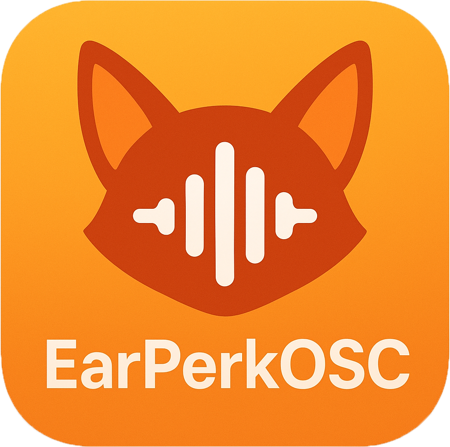
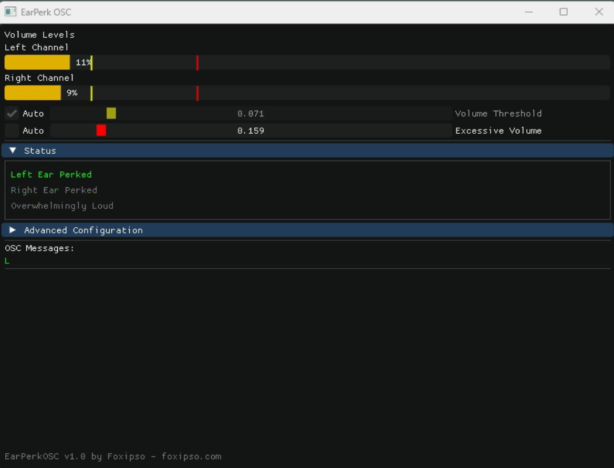

# 🎧 EarPerkOSC

**EarPerkOSC** is a C++ application with a Dear ImGui interface that listens to stereo audio from your system and sends OSC messages to 
make your VRChat avatar's ears perk. If a loud sound occurs mostly on your left side, the message to perk the left ear
will be sent, same for the right, and same for audio that's close to the center. If the audio is especially loud, your ears
can also fold back protectively!

After a delay (configurable), the message to unperk your ears may be sent (if the sound has stopped). Boolean VRCExpressionParameters are used to 
control the ear perking, and to only require 2 to 4 bits of space in your parameters.

Audio is captured from your system's audio output as a loopback device--so anything you hear, your avatar will react to (including Discord/Telegram
notification pings).




## 🖥️ Interface



EarPerkOSC features a real-time graphical interface showing:
- Live volume meters for left and right audio channels
- Volume threshold indicators for normal and excessive volume levels
- Status indicators for left ear, right ear, and overwhelm states
- Current OSC message status
- Configurable settings with real-time adjustment

## 🛰️ OSC Configuration 

An OSC connection is made to 127.0.0.1:9000 by default. The endpoint can be configured both through the UI and in the config.ini file.

**EarPerkOSC** works alongside other OSC applications like [VRCFT](https://github.com/benaclejames/VRCFaceTracking) and doesn't require any special OSC routing.

## 🦊 Avatar Configuration

You'll need to modify your avatar to respond to updates to the avatar parameters. EarPerkLeft and EarPerkRight booleans
at a minimum. You can use my template with [VRCFury](https://vrcfury.com/) to do this quite easily.

My template is available on my Gumroad: https://foxipso.gumroad.com

If you're creating this yourself, make the following animation files:

* Ear Left Perk
* Ear Left Neutral
* Ear Right Perk
* Ear Right Neutral
* Both Ears Fold

Then create an animation controller using the avatar parameters as floats (they're bools in the VRCExpressionParameters, but you use them as if they were floats).
You can animate them using direct and 1D blend trees. The animation clips don't need more than one keyframe.

## ⚙️ config.ini

Your `config.ini` file will automatically be created when you run the application for the first time.

**Config File Location:**
- **Windows**: `%APPDATA%\EarPerkOSC\config.ini` (typically `C:\Users\[Username]\AppData\Roaming\EarPerkOSC\config.ini`)
- **Linux/Mac**: `~/.config/EarPerkOSC/config.ini`

Here's a complete config.ini file with an explanation of the configurable parameters:

```ini
[connection]
address=127.0.0.1
port=9000
osc_address_left=/avatar/parameters/EarPerkLeft
osc_address_right=/avatar/parameters/EarPerkRight
osc_address_overwhelmingly_loud=/avatar/parameters/EarOverwhelm

[audio]
differential_threshold=0.027
volume_threshold=0.165
excessive_volume_threshold=0.234
reset_timeout_ms=1000
timeout_ms=100
```

* `address` and `port` are the address and port of the OSC server you're sending to (VRChat)
* `osc_address_left` and `osc_address_right` are the OSC addresses for the left and right ear parameters
* `osc_address_overwhelmingly_loud` is the OSC address for the "overwhelmingly loud" parameter
* `differential_threshold` is the minimum difference between channels to trigger a single-ear perk
* `volume_threshold` is the minimum volume needed to trigger an ear perk
* `excessive_volume_threshold` is the volume level that triggers protective ear folding
* `reset_timeout_ms` is the delay before unperking ears after sound stops
* `timeout_ms` is the minimum delay between ear perk attempts

All these parameters can be adjusted in real-time through the UI, and saved to the config file.

## 🛠️ Building

### Prerequisites
- Visual Studio 2022 with C++ desktop development workload
- CMake 3.15 or higher

### Dependencies (included)
- Dear ImGui
- GLFW
- GLAD
- oscpp
- inih

### Build Steps
1. Clone the repository
2. Open the project in Visual Studio
3. Build the solution
4. Run EarPerkOSC.exe from the output directory

## 💾 Installation

1. Download the latest release
2. Extract all files to a directory
3. Run EarPerkOSC.exe
4. The config.ini file will be created automatically in `%APPDATA%\EarPerkOSC\` on first run
5. Adjust settings through the UI or by editing the config file directly

## 🤝 Support

For support, please visit [foxipso.com](http://foxipso.com)

For Avatar prefabs, visit [foxipso.com](http://foxipso.com) or [foxipso.gumroad.com](https://foxipso.gumroad.com)

## 📅 Version History 

### 1.2 - Stability 
- Fixed issue where config settings weren't saved if the installation dir was system-owned
- Automatic config creation with better error handling
- Volume bar scaling - threshold indicators now stay within proper range
- Automatic audio device auto-reconnection
- Manual audio reconnect button to the UI
- More robust audio device handling and error recovery

### 1.0 - C++ rewrite with DearImGui interface
- Rewrite in C++ w/ DearImGui because Rust cringe
- Live volume meters and threshold visualization
- Auto-threshold adjustment based on ambient audio
- Differential audio detection for L/R
- OSC integration with VRChat

### 0.9 - Initial release
- Initial Rust implementation

## Acknowledgements

Thanks to [BenacleJames](https://github.com/benaclejames/) for help with Rust and testing

## ⚖️ License

This project is licensed under the Apache License - see the LICENSE file for details.